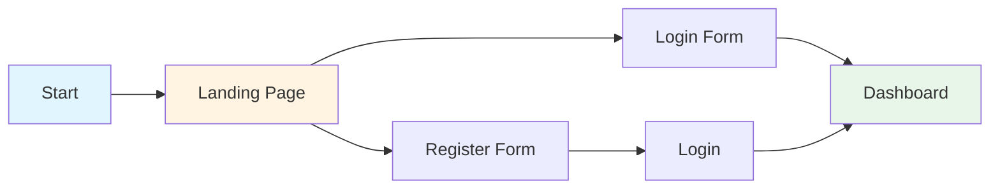
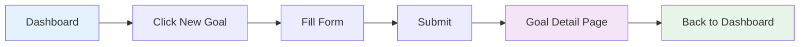
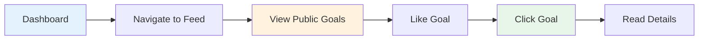

# Well Path

<!-- PROJECT SHIELDS -->
[![Contributors][contributors-shield]][contributors-url]
[![Forks][forks-shield]][forks-url]
[![Stargazers][stars-shield]][stars-url]
[![Issues][issues-shield]][issues-url]
[![MIT License][license-shield]][license-url]
[![LinkedIn][linkedin-shield]][linkedin-url]

<!-- PROJECT LOGO -->
<br />
<div align="center">
  <h1>🌱 Well Path</h1>
  <h3>A Health-Focused Goal Tracking Application</h3>
  <p>
    Set goals. Track progress. Share your journey.
    <br />
    <a href="https://github.com/younglafire/Well-Path"><strong>Explore the docs »</strong></a>
    <br />
    <br />
    <a href="https://github.com/younglafire/Well-Path">View Demo</a>
    ·
    <a href="https://github.com/younglafire/Well-Path/issues">Report Bug</a>
    ·
    <a href="https://github.com/younglafire/Well-Path/issues">Request Feature</a>
  </p>
</div>

<!-- TABLE OF CONTENTS -->
<details>
  <summary>Table of Contents</summary>
  <ol>
    <li>
      <a href="#about-the-project">About The Project</a>
      <ul>
        <li><a href="#built-with">Built With</a></li>
        <li><a href="#key-features">Key Features</a></li>
      </ul>
    </li>
    <li>
      <a href="#getting-started">Getting Started</a>
      <ul>
        <li><a href="#prerequisites">Prerequisites</a></li>
        <li><a href="#installation">Installation</a></li>
      </ul>
    </li>
    <li><a href="#testing">Testing</a></li>
    <li><a href="#usage">Usage</a></li>
    <li><a href="#dfds">DFDs</a></li>
    <li><a href="#website-flow">Website Flow</a></li>
    <li><a href="#roadmap">Roadmap</a></li>
    <li><a href="#development-process">Development Process</a></li>
    <li><a href="#contact">Contact</a></li>
    <li><a href="#acknowledgments">Acknowledgments</a></li>
  </ol>
</details>

<!-- ABOUT THE PROJECT -->
## About The Project

Well Path is a health-focused goal tracking application designed to help users set meaningful goals, monitor their progress, and connect with others for motivation. Built as my CS50W Final Project, this application demonstrates full-stack web development capabilities with a focus on clean architecture, user experience, and social interaction.

**The Philosophy Behind Well Path:**

The idea is simple but powerful: achieving health goals becomes easier when you can track your progress and share your journey with others. Whether it's exercise milestones, nutrition targets, or fitness achievements, Well Path provides the tools to stay accountable and motivated.

**My Role & Approach:**

- **Backend & Core Features**: I implemented all functionality, database models, and business logic from scratch
- **Frontend/UI**: Leveraged AI tools to generate initial components and layouts, then debugged and customized them to integrate seamlessly with my backend
- **Focus**: Designed with health goals in mind, but the architecture is flexible enough to extend to other goal categories

This project showcases my ability to:
- Design and implement full-stack web applications
- Work with modern web frameworks and databases
- Debug and integrate AI-generated code with custom backend logic
- Build scalable, deployment-ready applications
- Implement both individual and social features

<p align="right">(<a href="#readme-top">back to top</a>)</p>

### Built With

<p align="center">
  <a href="https://www.python.org/"></a>
  <a href="https://www.djangoproject.com/"></a>
  <a href="https://www.sqlite.org/"></a>
  <a href="https://www.postgresql.org/"></a>
  <a href="https://developer.mozilla.org/en-US/docs/Web/HTML"></a>
  <a href="https://developer.mozilla.org/en-US/docs/Web/CSS"></a>
  <a href="https://developer.mozilla.org/en-US/docs/Web/JavaScript"></a>
  <a href="https://git-scm.com/"></a>
  <a href="https://github.com/"></a>
</p>

**Technology Stack:**
- **Backend**: Django (Python web framework)
- **Database**: SQLite for development, easily switchable to PostgreSQL for production
- **Frontend**: HTML, CSS, JavaScript with Django templates
- **Version Control**: Git & GitHub
- **Deployment**: Ready for Heroku, Render, or other platforms

<p align="right">(<a href="#readme-top">back to top</a>)</p>

### Key Features

✅ **Complete CRUD Operations**
- Create, read, update, and delete personal goals
- Full control over your goal management

🎯 **Progress Tracking**
- Optional progress monitoring for each goal
- Visual feedback on your achievements

🔍 **Smart Organization**
- Sort and filter goals for easy navigation
- Find exactly what you need, when you need it

📄 **Detailed Goal Pages**
- Clean, intuitive layout for each goal
- All information at a glance

🌐 **Social Features**
- Public goals feed to share your journey
- Like system only
- Connect with others pursuing similar goals

🚀 **Production-Ready**
- Thoroughly tested with 66 comprehensive unit tests
- Deployment-ready architecture
- Scalable database design

<p align="right">(<a href="#readme-top">back to top</a>)</p>

<!-- GETTING STARTED -->
## Getting Started

Follow these steps to get Well Path running on your local machine for development and testing purposes.

### Prerequisites

Make sure you have the following installed:
- Python 3.8 or higher
- pip (Python package installer)
- Git

### Installation

1. **Clone the repository**
   ```sh
   git clone https://github.com/younglafire/Well-Path.git
   cd Well-Path
   ```

2. **Create a virtual environment (recommended)**
   ```sh
   python -m venv venv
   source venv/bin/activate  # On Windows: venv\Scripts\activate
   ```

3. **Install required packages**
   ```sh
   pip install -r requirements.txt
   ```

4. **Apply database migrations**
   ```sh
   python manage.py migrate
   ```

5. **Create a superuser (optional, for admin access)**
   ```sh
   python manage.py createsuperuser
   ```

6. **Run the development server**
   ```sh
   python manage.py runserver
   ```

7. **Open your browser and navigate to**
   ```
   http://127.0.0.1:8000/
   ```

<p align="right">(<a href="#readme-top">back to top</a>)</p>

<!-- TESTING -->
## Testing

Well Path includes a comprehensive test suite to ensure code quality and reliability. Tests cover models, views, services, and forms across all applications.

### Running Tests

**Run all tests:**
```sh
cd WellPath
python manage.py test
```

**Run tests for a specific app:**
```sh
python manage.py test goals      # Test the goals app
python manage.py test social     # Test the social app
python manage.py test taxonomy   # Test the taxonomy app
```

**Run tests with verbose output:**
```sh
python manage.py test --verbosity=2
```

**Run a specific test class or method:**
```sh
python manage.py test goals.tests.GoalModelTest
python manage.py test goals.tests.GoalModelTest.test_goal_creation
```

### Test Coverage

The project includes **66 comprehensive tests** covering:

📋 **Goals App (40 tests)**
- User model and authentication
- Goal model with status calculations
- Progress tracking with daily constraints
- Progress photos with file uploads
- Business logic in service layer
- User registration and goal forms

👥 **Social App (11 tests)**
- Like model with unique constraints
- Like/unlike toggle functionality
- AJAX endpoints for social features

🏷️ **Taxonomy App (15 tests)**
- Category model with slug generation
- Unit model and ordering
- Category filtering views
- AJAX unit loading endpoint

### Understanding the Tests

Each test file includes detailed comments explaining:
- **What** is being tested
- **Why** it's important
- **How** the test works

This makes the tests a great learning resource for understanding Django development patterns!

### Example Test Structure

```python
def test_goal_creation(self):
    """
    Test that a goal is created successfully with all fields.
    
    This checks:
    - The goal exists in the database
    - All fields are stored correctly
    """
    self.assertEqual(self.goal.title, "Run 100km")
    self.assertTrue(self.goal.is_public)
```

### Writing New Tests

When adding new features:
1. Write tests first (Test-Driven Development)
2. Run tests to see them fail
3. Implement the feature
4. Run tests to see them pass

<p align="right">(<a href="#readme-top">back to top</a>)</p>

<!-- USAGE EXAMPLES -->
## Usage

**Getting Started with Well Path:**

1. **Create an Account**: Register to start tracking your health goals
2. **Set Your First Goal**: Define what you want to achieve (e.g., "Run 5km three times a week")
3. **Track Progress**: Update your progress as you work toward your goal
4. **Share Your Journey**: Make goals public to inspire others and receive support
5. **Engage with the Community**: Like other users' goals 

**Example Use Cases:**
- Track fitness milestones (running distance, workout frequency)
- Monitor nutrition goals (water intake, meal planning)
- Set and achieve wellness targets (meditation minutes, sleep hours)
- Share transformation journeys with supportive community

<p align="right">(<a href="#readme-top">back to top</a>)</p>

<!-- DFDS -->
## DFDs


<!-- Context Diagram -->
### Context Diagram For All Apps


<!-- WEBSITE FLOW -->

## Website Flow

https://github.com/user-attachments/assets/a0ffd798-5d1c-4a90-982a-afdb17e3ab10

### User Registration & Authentication Flow

### Goal Creation & Management Flow

### Social Interaction Flow


### 🎨 System State Diagram

```
                    ┌──────────────┐
                    │  Anonymous   │
                    │    User      │
                    └──────┬───────┘
                           │
                    ┌──────▼───────┐
                    │   Register/  │
                    │    Login     │
                    └──────┬───────┘
                           │
                    ┌──────▼───────┐
              ┌─────┤ Authenticated├─────┐
              │     │     User     │     │
              │     └──────────────┘     │
              │                          │
       ┌──────▼──────┐          ┌───────▼────────┐
       │   Personal  │          │     Social     │
       │    Goals    │          │     Feed       │
       └──────┬──────┘          └───────┬────────┘
              │                          │
    ┌─────────┼─────────┐               │
    ▼         ▼         ▼               ▼
┌────────┐ ┌──────┐ ┌──────┐    ┌────────────┐
│ Create │ │ Edit │ │Delete│    │  Comment   │
└────────┘ └──────┘ └──────┘    └────────────┘
```
<p align="right">(<a href="#readme-top">back to top</a>)</p>

<!-- ROADMAP -->
## Roadmap

### Completed Features ✅
- [x] User authentication and authorization
- [x] Complete CRUD operations for goals
- [x] Progress tracking system
- [x] Goal sorting and filtering
- [x] Detailed goal pages
- [x] Public goals feed
- [x] Responsive design
- [x] Database models and relationships
- [x] Comprehensive test suite (66 tests covering all apps)

### Future Enhancements 🚀
- [ ] Goal categories and tags
- [ ] Comment system
- [ ] Achievement badges and milestones
- [ ] User profiles with statistics
- [ ] Follow/friend system
- [ ] Notification system
- [ ] Mobile app (React Native)
- [ ] API for third-party integrations
- [ ] Goal templates and recommendations
- [ ] Export progress reports

See the [open issues](https://github.com/younglafire/Well-Path/issues) for a full list of proposed features and known issues.

<p align="right">(<a href="#readme-top">back to top</a>)</p>


## Known Issues 
- No current value
- The chart won't work without value, and the logic of it is off
<!-- DEVELOPMENT PROCESS -->
## Development Process

Well Path was built following a structured, phase-based approach:

### Phase 1: Core CRUD Operations
- Implemented database models for users, goals, and progress
- Built basic CRUD functionality
- Established project foundation and architecture

### Phase 2: Enhanced User Experience
- Designed and implemented goal detail pages
- Added sorting and filtering capabilities
- Refined UI for better usability

### Phase 3: Social Features
- Created public goals feed
- Added user interaction capabilities

### Phase 4: Polish & Deployment
- UI/UX refinements and responsive design
- Comprehensive testing and bug fixes
- Deployment preparation and optimization

**Technical Decisions:**
- Chose Django for its robust ORM and built-in admin interface
- Used SQLite for development with easy PostgreSQL migration path
- Implemented AI-assisted frontend development with manual debugging and integration
- Structured code for scalability and maintainability

<p align="right">(<a href="#readme-top">back to top</a>)</p>

<!-- CONTACT -->
## Contact

**Project Developer**: [Your Name]

- GitHub: [@younglafire](https://github.com/younglafire)
- LinkedIn: [Your LinkedIn](https://linkedin.com/in/your-linkedin-username)
- Email: your.email@example.com

**Project Link**: [https://github.com/younglafire/Well-Path](https://github.com/younglafire/Well-Path)

<p align="right">(<a href="#readme-top">back to top</a>)</p>

<!-- ACKNOWLEDGMENTS -->
## Acknowledgments

* [CS50W - Web Programming with Python and JavaScript](https://cs50.harvard.edu/web/)
* [CS50x - Introduction to Computer Science](https://cs50.harvard.edu/x/)
* [Django Documentation](https://docs.djangoproject.com/)
* [Best-README-Template](https://github.com/othneildrew/Best-README-Template)
* [Shields.io - Badges](https://shields.io/)

---

<p align="center">
  <i>Built with ❤️ as part of my journey to becoming a professional developer</i>
</p>

<!-- MARKDOWN LINKS & IMAGES -->
[contributors-shield]: https://img.shields.io/github/contributors/younglafire/Well-Path.svg?style=for-the-badge
[contributors-url]: https://github.com/younglafire/Well-Path/graphs/contributors
[forks-shield]: https://img.shields.io/github/forks/younglafire/Well-Path.svg?style=for-the-badge
[forks-url]: https://github.com/younglafire/Well-Path/network/members
[stars-shield]: https://img.shields.io/github/stars/younglafire/Well-Path.svg?style=for-the-badge
[stars-url]: https://github.com/younglafire/Well-Path/stargazers
[issues-shield]: https://img.shields.io/github/issues/younglafire/Well-Path.svg?style=for-the-badge
[issues-url]: https://github.com/younglafire/Well-Path/issues
[license-shield]: https://img.shields.io/github/license/younglafire/Well-Path.svg?style=for-the-badge
[license-url]: https://github.com/younglafire/Well-Path/blob/master/LICENSE.txt
[linkedin-shield]: https://img.shields.io/badge/-LinkedIn-black.svg?style=for-the-badge&logo=linkedin&colorB=555
[linkedin-url]: https://linkedin.com/in/your-linkedin-username
